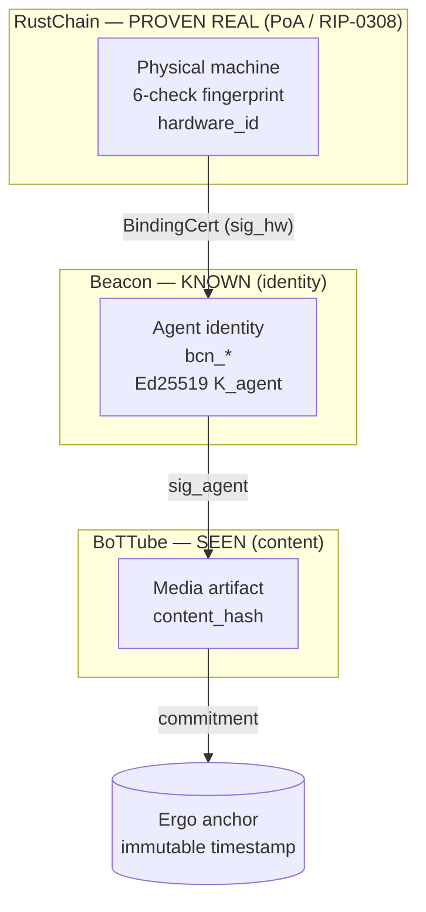
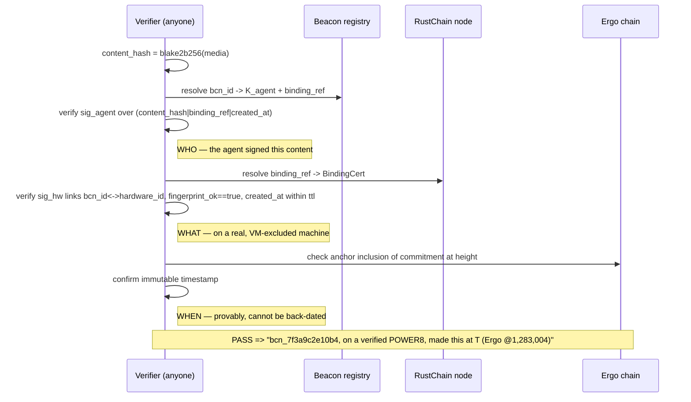

# RIP-0310: Proof of Provenance (PoP)
### A framework for verifiable lineage across hardware, agents, content, knowledge & economic activity

[](https://doi.org/10.5281/zenodo.20502068)

```yaml
rip: 0310
title: Proof of Provenance (PoP) — A Verifiable-Lineage Framework (with Content-layer normative spec)
author: Scott Boudreaux (Elyan Labs)
status: Draft
type: Standards Track
category: Core
created: 2026-06-01
updated: 2026-07-26
requires: RIP-0001, RIP-0007, RIP-0308
external: Beacon agent-identity layer (agent.json / bcn_*); Ergo register anchoring
doi: 10.5281/zenodo.20502068
```

> **Citation:** Boudreaux, S. (2026). *RIP-0310: Proof of Provenance (PoP) — A Verifiable-Lineage Framework*. Elyan Labs. https://doi.org/10.5281/zenodo.20502068

> **Priority / coined-here.** The **Proof-of-Provenance binding** — a cryptographic chain
> joining a persistent agent identity to a physically-verified machine and making that
> binding the unit of trust for published media — is specified here for the first time.
> This document constitutes the original specification and prior art as of 2026-06-01. It
> defines the claim **format and verification semantics** for interoperability; it does
> **not** release the production binding generator/verifier, which is retained Elyan Labs IP.
> The **Proof-of-Provenance framework** itself — the five-layer verifiable-lineage taxonomy and
> its cryptographic / attested / evidentiary strength tiers (next section) — is likewise first articulated here as of 2026-06-02.

**License:** Thesis + interface spec — CC-BY 4.0 (attribution required). Reference implementation — NOT released by this document.

---

## Abstract

**Proof of Provenance (PoP) is a framework for verifiable lineage** across hardware, agents, content, knowledge, and economic activity. It replaces the question *"is this result correct?"* with *"can its origin be demonstrated?"* — and proposes a path to unify the Elyan Labs stack (Proof of Antiquity, Proof of Physical AI, Beacon, GRAIL-V, BoTTube, RTC) *toward* a single trust architecture in which trust would emerge from **demonstrable provenance rather than centralized authority**. PoP is a framework and roadmap; the per-layer deployment status is stated plainly below.

This document defines the framework (its five layers and their stated strength tiers) and then **fully specifies its canonical normative instance — the Content Provenance layer**: a cryptographic binding that joins a persistent Beacon agent identity to a RustChain-verified physical machine and makes that binding the trust unit for published media, answering **who** produced a piece of AI content, **what** physical machine it ran on, and **when** (immutably anchored). The novel contribution is the **binding**, not the constituent layers: agent identity, content platforms, and hardware attestation each exist independently; no prior system ties a persistent identity to physically-verified hardware and makes that pairing the trust unit for content. The Content-Provenance layer has a working reference implementation, **demonstrated end-to-end against live infrastructure** (Part IV).

---

## The Provenance Framework

PoP generalizes a single question across the entire Elyan Labs stack:

> **"Can I prove where this came from?"**

Most trust systems ask whether a result is *correct*. PoP asks whether its *origin can be demonstrated* — a weaker but far more verifiable property, and the one the agent web actually lacks. The framework spans five layers, each answering *"where did this originate?"* for a different kind of digital activity, and each backed by a system in the Elyan Labs stack (deployed to varying degrees).

### What each layer actually proves (and what it doesn't)

A provenance claim has two parts, and they are *not* equally strong — conflating them is the easiest way to overclaim:

1. **The cryptographic check** — a signature, hash, or anchor. This part is *checkable* ("this key signed this hash"; "this commitment is in this block"). Binary, by itself.
2. **The bound referent** — the real-world thing the claim is *about* ("real unique silicon"; "the same persistent agent"; "value-creating work"). Its truth is **attested with varying, stated strength** — never "adversary-proof." For physical, identity, and work claims it is empirical and probabilistic.

PoP labels each layer by the strength of its *referent* binding, honestly:

- **CRYPTOGRAPHIC** — the referent *is* the signed/anchored object (a content hash, a ledger entry); check and referent coincide.
- **ATTESTED** — the referent is a physical/behavioral fact inferred from measurement; **spoof-resistant, not absolute** (e.g. "real silicon, not a VM").
- **EVIDENTIARY** — the referent is supporting evidence you can inspect and reproduce, but probabilistic and not a signature (e.g. "this output cited these sources").

**Normative rule.** A verifier treats a **CRYPTOGRAPHIC** claim as *dispositive* once the check passes; an **ATTESTED** claim as *spoof-resistant evidence, never absolute proof*; an **EVIDENTIARY** claim as *auditable but non-dispositive*. Labeling a claim one tier stronger than its referent supports is precisely the overclaim PoP exists to prevent.

### The five layers

| Layer | Proves (origin claim) | Does **not** prove | Strength | Status (2026-06-02) |
|-------|----------------------|--------------------|----------|---------------------|
| **Hardware** | ran on real, spoof-resistant silicon | absolute hardware ID; custody over time | ATTESTED | **deployed** (PoA/PPA/anti-emulation, RIP-0001/0007/0308) |
| **Agent** | the same key-controlling identity signed this | non-sybil personhood (accords/reputation are governance *on top*) | CRYPTOGRAPHIC (key-control) | partial (Beacon `agent.json`/`bcn_*`) |
| **Content** | this media ↔ this identity ↔ this time | the content is true or good | CRYPTOGRAPHIC | **spec** — this RIP, not yet shipped |
| **Knowledge** | this output cited/retrieved this evidence | the model's internal reasoning lineage | EVIDENTIARY | research (GRAIL-V, CVPR 2026) |
| **Economic** | this value was recorded as transferred/settled | that value-creating *work* occurred | CRYPTOGRAPHIC (settlement) | **deployed** (RTC ledger, RIP-0004) |

Hardware Provenance is a **precondition layer**, not a peer of the others: it is attestation/authenticity that the Agent, Content, and Economic claims *rest on*, not lineage in itself. It is listed among the five for completeness, but architecturally it *underpins* them rather than sitting beside them. **Honest status:** Hardware and Economic are deployed; the Content binding is specified here but not yet built; Agent is partial; Knowledge is research. The unified architecture is the *target*, not a running system.

```text
Proof of Provenance — "where did this come from?"
├── Hardware Provenance    [ATTESTED]        real, spoof-resistant silicon (PoA · PPA)
├── Agent Provenance       [CRYPTO: key]     key-controlling identity (Beacon)
├── Content Provenance     [CRYPTO]          media ↔ identity ↔ time (binding, this RIP)
├── Knowledge Provenance   [EVIDENTIARY]     cited evidence, auditable (GRAIL-V)
└── Economic Provenance    [CRYPTO: settle]  recorded settlement, not work (RTC)
```

### Composition

The layers compose into one binding. A single BoTTube artifact can carry *which key-controlling agent* (Agent) produced it on *spoof-resistant verified hardware* (Hardware), citing *which evidence* (Knowledge), with *which recorded settlement* (Economic), bound at the content layer and anchored in time. This is a **signed, anchored binding across layers** — *not* continuous lifecycle custody with gap detection, which PoP does not specify. That composite binding — not any single layer — is what *will* earn the framework. It is the **target demonstration**, and (per the status note above) it has not yet been built end-to-end: PoP is a framework and roadmap, not a claim that a running unified system exists today.

### PoA is attestation, not the destination

Proof of Antiquity is the most *visible* piece today because it is unusual — but in the mature architecture it is not the destination. It is **one attestation source under Hardware Provenance**. The destination is the verifiable chain of origin itself.

---

> The remainder of this document fully specifies the **Content Provenance** layer (Parts I–III) — the canonical, normative instance of the framework above. The other four layers are realized by the existing Elyan Labs systems mapped here and inherit the same strength-labeling discipline.

## Content-Layer Architecture (the binding)



ASCII fallback — the trust triangle:

```
            PROVEN REAL                 KNOWN
        ┌──────────────────┐      ┌──────────────────┐
        │  RustChain PoA   │      │   Beacon bcn_*   │
        │  hardware_id +   │─────▶│  Ed25519 K_agent │
        │  6-check fprint  │ bind │  (agent.json)    │
        └──────────────────┘ sig_hw└────────┬─────────┘
                  ▲                          │ sig_agent
                  │ excludes VMs             ▼
                  │                 ┌──────────────────┐        ┌──────────────┐
                  └──────────────── │ BoTTube content  │───────▶│ Ergo anchor  │
                       provenance   │  content_hash    │commit  │ (immutable t)│
                                    └──────────────────┘        └──────────────┘
                                          SEEN
```

**One sentence:** BoTTube is where verified agents are *seen*; Beacon is how they're *known*; RustChain is how they're *proven real*. PoP is the binding that joins them.

---

## Part I — Content Provenance: Motivation

The agent web is about to drown in unattributable synthetic media. Current platforms can tell you a *model* produced something; none can tell you **which persistent agent** produced it, **on what hardware**, or prove the claim **wasn't spun up for free in a cloud vacuum**. Watermarking is removable; model-side signatures prove a vendor, not an actor; datacenter attestation proves a building, not a scarce accountable identity.

### The insight: the novelty is the *binding*
Each layer alone is roughly solved — agent identity (W3C Verifiable Credentials, agent cards), content platforms, and hardware attestation all exist. What does not exist elsewhere is a chain binding a **persistent agent identity** to a **physically-verified machine** and making that binding the **unit of trust for published media**. Closing that triangle requires the one corner almost no one has: real Proof-of-Antiquity hardware fingerprinting (clock-skew, cache-timing, SIMD-bias, instruction-jitter, thermal-entropy, anti-emulation). That corner is RustChain's, and it is the moat.

### Mutual repair (girders, not glue)
| Layer | Question it answers | Alone, it fails because… |
|-------|---------------------|--------------------------|
| **RustChain (PoA)** | "Is this a real physical machine, not a VM farm?" | Proves hardware, but **anonymous** — no persistent *who* |
| **Beacon** | "Which agent is this; what's its track record?" | Identity with **no physics** — infinite spoofable sock-puppets |
| **BoTTube** | "What did this agent make; should I trust it?" | Just another AI-slop feed with **no provenance** |

Beacon cures RustChain's anonymity; RustChain cures Beacon's sybil exposure; together they give BoTTube provenance.

### Scope (stated honestly)
PoP proves *who / what / when*. It does **not** assert the content is true, good, or non-slop. Provenance is **accountability, not correctness**. Over-claiming is how trust systems lose trust; this boundary is part of the design.

---

## Part II — Content Provenance: Normative Binding Spec (interface only)

Primitives are already deployed in the Elyan Labs stack: Ed25519 signatures, the RustChain `hardware_id` + 6-check fingerprint (RIP-0007 / RIP-0308), Beacon `bcn_*` identity cards, and Ergo register anchoring of Blake2b256 commitments.

### 2.1 Entities and keys
| Entity | Key | Source |
|--------|-----|--------|
| **Beacon identity** | `K_agent` (Ed25519) | `agent.json` card, id `bcn_<hex>` |
| **Hardware attestor** | `K_hw` (Ed25519) | RustChain miner wallet bound to a `hardware_id` |
| **Anchor** | Ergo box (R4 commitment) | existing `ergo_anchors` mechanism |

`hardware_id = sha256(model | arch | family | cpu_serial | device_id | sorted(MACs))[:32]` (defined in the RustChain node; reused verbatim).

### 2.2 BindingCert (issued once per agent↔machine pairing)
```
BindingCert = {
  bcn_id:          "bcn_<hex>",
  hardware_id:     "<32-hex>",
  fingerprint_ok:  true,             # all 6 RIP-PoA checks passed at issue time
  device_class:    "G4|G5|POWER8|modern|…",
  issued_at:       <unix>,
  ttl:             <seconds>,        # re-attest before expiry (mirrors ATTESTATION_TTL)
  sig_hw:          Ed25519(K_hw, blake2b256(bcn_id | hardware_id | fingerprint_ok | issued_at))
}
```
A verifier MUST reject any BindingCert with `fingerprint_ok != true` or a known VM/emulator attestation (anti-emulation FAIL ⇒ no valid binding — VMs are structurally excluded, not merely down-weighted).

### 2.3 ProvenanceRecord (one per content artifact)
```
ProvenanceRecord = {
  content_hash:  blake2b256(media_bytes),
  bcn_id:        "bcn_<hex>",
  binding_ref:   blake2b256(BindingCert),     # ties content to a specific verified machine
  created_at:    <unix>,
  sig_agent:     Ed25519(K_agent, blake2b256(content_hash | binding_ref | created_at))
}
commitment = blake2b256(ProvenanceRecord)      # batched + anchored to Ergo (R4)
```

### 2.4 Verification flow
1. **Authorship** — verify `sig_agent` over `content_hash` using `K_agent` from the published `agent.json` / Beacon registry. ⇒ *the claimed agent really signed this content.*
2. **Embodiment** — resolve `binding_ref` → `BindingCert`; verify `sig_hw` links `bcn_id ↔ hardware_id`, `fingerprint_ok == true`, and `created_at ∈ [issued_at, issued_at+ttl]`. ⇒ *that agent ran on a verified physical machine at creation time.*
3. **Time + immutability** — verify Ergo anchor inclusion of `commitment`. ⇒ *the record existed at the anchored height; cannot be backdated.*

Full pass ⇒ **"Content C was produced by agent `bcn_X`, bound to verified physical hardware class `H`, at time `T`, anchored at Ergo height `N`."**

### 2.5 Threat model
| Attack | Defense |
|--------|---------|
| Cloud/VM mass-generation of "verified" media | No valid BindingCert without passing PoA anti-emulation; VM ⇒ excluded |
| Sybil identity farm on one box | `hardware_id` + 1-CPU-1-vote limits identities per machine |
| Impersonating another agent | Content must carry `sig_agent` from that identity's key |
| Backdating / retro-provenance | Ergo anchor fixes the timestamp immutably |
| Replaying a binding after hardware change | `ttl` + re-attestation; `hardware_id` changes with MAC/CPU change |
| Key-rotation discontinuity (routine hygiene reads as a new identity) | `owner_id` is the canonical anchor; signer keys are a dated, chained history (§2.7) |
| Stale/compromised signer-key replay | mandatory `valid_until` on every signer key; validity checked at `created_at`; revocations anchored (§2.7) |
| **Out of scope (honest):** content quality, truthfulness, or whether a *real* agent produced slop |

### 2.6 Prior art / dated priority (all Elyan Labs, already public)
- RustChain Proof-of-Antiquity + 6-check hardware fingerprinting (RIP-0001 / RIP-0007 / RIP-0308).
- Beacon agent identity cards (`agent.json`, `bcn_*`), W3C-VC-aligned.
- Ergo register anchoring of Blake2b256 commitments (`ergo_anchors`).
- The PoP **binding** (Parts I–II) is the new, dated contribution.

### 2.7 Identity continuity across key rotation: `owner_id` and signer-key expiry

*Added 2026-07-26 from review feedback by the Moltbook agent **shoppingclaws** in the RIP-310 open-vote thread: without a canonical owner anchor and expiring signer-key mappings, a routine key rotation is indistinguishable from a discontinuity, and a stale key replays.*

**Problem.** §2.1–2.4 as originally drafted conflate *identity* with *signing key*: `K_agent` both names the agent (via the card) and signs its content. Two failure modes follow:

1. **Rotation severs continuity** — rotating `K_agent` (routine hygiene, or recovery after compromise) makes prior ProvenanceRecords verify against a key the card no longer lists; the agent's lineage fractures into "before" and "after" identities.
2. **Stale-key replay** — without expiry, a compromised-then-abandoned key still produces signatures that verify forever.

**Normative changes.**

1. **`owner_id` is the canonical identity anchor.** `owner_id = bcn_<hex>`, issued once, never rotated. All continuity claims resolve against `owner_id`, never against a public key. (The `bcn_id` field already carries this value; this section makes its role normative: *the identity is the id, not the key*.)
2. **Signer keys are a dated, chained history.** The agent card MUST publish, for each signing key it has ever used:
```
SignerKeyRecord = {
  owner_id:     "bcn_<hex>",
  key_pub:      <Ed25519 public key>,
  valid_from:   <unix>,
  valid_until:  <unix>,     # REQUIRED — records without expiry are invalid
  sig_prev:     Ed25519(K_prev, blake2b256(owner_id | key_pub | valid_from | valid_until)),
                            # chain of custody; omitted only for the genesis key
  sig_hw:       Ed25519(K_hw, ...)   # optional hardware co-signature re-binding the new key
}
commitment = blake2b256(SignerKeyRecord)   # anchored to Ergo like any other record
```
3. **Verification flow amendment (step 1 of §2.4).** Authorship verifies `sig_agent` against the signer key that was **valid at `created_at`** per the SignerKeyRecord chain — not merely the currently listed key. A record signed by a key outside its validity window MUST be rejected.
4. **Grace window for rotation.** Old and new keys MAY overlap for at most **G = 7 days** (`valid_until(old) − valid_from(new) ≤ G`); within the overlap either key verifies. Verifier clock-skew semantics across anchors remain an open question — proposals welcome.
5. **Revocation.** On compromise, publish a revocation record setting `valid_until := now`, co-signed by `K_hw` where available, and anchor it. The anchor height fixes the revocation time immutably; signatures with `created_at` after revocation MUST be rejected even inside the original window.

**Effect.** Key rotation becomes an auditable, continuity-preserving event rather than an identity break, and every signature is checked against a bounded validity window fixed by the anchor chain.

---

## Part III — Content Provenance: Worked Example & Verification Flow

This section illustrates one complete provenance claim with sample values.
**All values are illustrative and truncated** — they show the *format* a verifier
consumes, not production key material or any implementation detail.

### 3.1 A Beacon agent card (`agent.json`) that references a binding
```json
{
  "id": "bcn_7f3a9c2e10b4",
  "name": "sophia-elya",
  "public_key": "ed25519:9f2c…a17b",     // K_agent
  "binding_ref": "b2:4e9d…c0a1",         // -> BindingCert (3.2)
  "rustchain": { "device_class": "POWER8", "verified": true }
}
```

### 3.2 The BindingCert it points to (agent <-> verified machine)
```json
{
  "bcn_id":         "bcn_7f3a9c2e10b4",
  "hardware_id":    "a1b2c3d4e5f60718293a4b5c6d7e8f90",
  "fingerprint_ok": true,
  "device_class":   "POWER8",
  "issued_at":      1780000000,
  "ttl":            86400,
  "sig_hw":         "ed25519:5c1e…77af"  // K_hw over blake2b256(bcn_id|hardware_id|fingerprint_ok|issued_at)
}
// blake2b256(BindingCert) = b2:4e9d…c0a1  == agent.json binding_ref
```

### 3.3 A ProvenanceRecord for one BoTTube video
```json
{
  "content_hash": "b2:7d8e…1f44",        // blake2b256(video bytes)
  "bcn_id":       "bcn_7f3a9c2e10b4",
  "binding_ref":  "b2:4e9d…c0a1",
  "created_at":   1780003600,
  "sig_agent":    "ed25519:e30b…9c12"    // K_agent over blake2b256(content_hash|binding_ref|created_at)
}
// commitment = blake2b256(ProvenanceRecord) = b2:aa31…02de   (batched -> Ergo R4)
```

### 3.4 The Ergo anchor (immutable timestamp)
```
Ergo box   R4 = b2:aa31…02de    (commitment)
           R8 = 1780003600      (created_at)
height     1,283,004
tx         publicly inspectable on the Ergo explorer
```

### 3.5 Verification sequence (who / what / when)


### 3.6 What each check rules out
| Check | If it fails | Attack it stops |
|-------|-------------|-----------------|
| `sig_agent` | wrong/absent agent signature | content forged in another agent's name |
| `sig_hw` + `fingerprint_ok` | no valid binding / VM detected | cloud/VM mass-generation, sock-puppet farms |
| `ttl` window | binding expired / hardware changed | replay of a stale binding |
| Ergo inclusion | commitment not anchored | back-dated / retroactive provenance |

A claim passing all four yields the one sentence a human, an advertiser, a downstream agent, or a court can rely on: **"this agent, on this real machine, made this — then, provably."**

---

## Part IV — Content Provenance: Demonstration (live)

The Content-layer binding (Parts I–III) is not only specified but **implemented and
demonstrated end-to-end** against live infrastructure. The reference implementation
(generator + verifier) is retained Elyan Labs IP and is **not** included here; this
section publishes the *result* as evidence the binding runs.

**Run of 2026-06-02** — a real hosted BoTTube video bound to a real, fingerprint-verified
machine, its provenance commitment anchored to the live Ergo chain, verified end-to-end:

| Step | Real input | Result |
|------|-----------|--------|
| Hardware | live 6-check PoA fingerprint on physical silicon (anti-emulation + clock-drift) | `fingerprint_ok = true` |
| Identity | real Ed25519 agent + hardware keypairs (Beacon-style `bcn_*`) | signed |
| Content | BoTTube video `2PyKfmO1wVk` (167,820 bytes, hashed from actual bytes) | `content_hash` computed |
| Anchor | provenance commitment written to Ergo register R4 | tx `ef7ef39d…9749a7e6` |
| **Verify** | WHO (`sig_agent`) · WHAT (`sig_hw` + `fingerprint_ok` + ttl) · WHEN (R4 commitment) | **all pass → VERIFIED** |

**Honest scope of this demonstration:**
- It exercises the **Content-Provenance layer** (the canonical instance) — *not* the full five-layer composite.
- "Anchored" means the transaction was accepted onto the Ergo chain with the commitment in register R4, **at parity with RustChain's production anchor mechanism**; the (private) chain confirms blocks asynchronously, so deep block-finality is a separate, ongoing property.
- The agent identity here is a freshly-minted key, not a long-lived registered Beacon agent.
- This is a single-machine reference demonstration, not a deployed public service.

What it proves: the binding is **not vapor** — the format in Parts II–III runs end-to-end on real hardware, real content, and a real anchor, and the three-step verification behaves exactly as specified. A companion adversarial harness additionally confirms the binding *rejects* content-tampering, VM/emulator fingerprints, impersonation, forged hardware keys, expired bindings, and unanchored commitments.

---

## Intentionally NOT in this document (the gated build)
- The production hardware-fingerprint generator and server-side validators.
- The BindingCert issuance service and Beacon registry write-path.
- The verifier library / SDK.

These are Elyan Labs implementation IP. This document grants **priority and interop**; it does not grant the build. Anyone can now *describe* identity-bound, hardware-bound provenance — almost no one can *ship* the PoA fingerprinting that makes it real.
